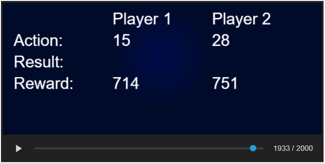

#  Kaggle's Santa 2020

This is my solution of the **Multi-Armed Bandit** where I got 74th/792 (top 10%) and received a **bronze medal**

## Overview

This Python script implements a Multi-Armed Bandit (MAB).
The MAB agent aims to make decisions (pull arms) that maximize its total reward over time, considering both exploration and exploitation strategies.

## Code Structure

There are two examples in the code of MAB agents. The juypter notebook works as a testing center and for file submission.

## My Submission (antony_heuristic.py)
## Global Variables

- `total_reward`: Cumulative reward obtained by the agent.
- `bandit_dict`: Dictionary storing information about each bandit, including wins, losses, opponent encounters, visits, and more.
- `exploration_done`: Flag indicating the status of exploration (0: not started, 1: in progress, 2: completed).
- `mimic_count`: Counter for tracking the number of times the agent mimics opponent behavior.
- `stepping`: Counter representing the current step in the environment.

## Functions

### `get_next_bandit()`

- Determines the next bandit to pull based on exploration and exploitation strategies.
- Analyzes opponent behavior, explores new options, and mimics opponents in certain conditions.

### `multi_armed_probabilities(observation, configuration)`

- Main function for the MAPE environment interface.
- Receives observations and configuration, updates bandit statistics, and uses `get_next_bandit()` to decide the next bandit to pull.
